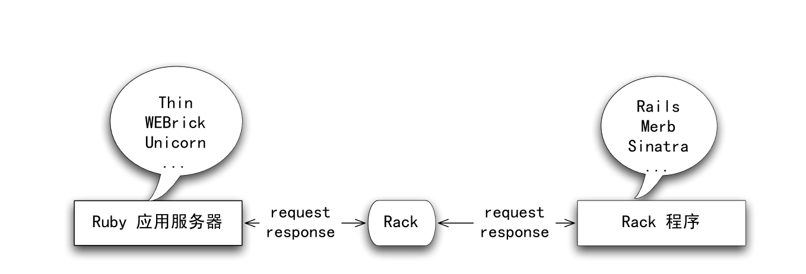

## 1.简介
### 1.1什么是Rack
Rack是Ruby应用服务器和Rack应用程序之间的一个接口。


用户的请求抵达应用服务器时，应用服务器会调用(call)Rack,Rack对请求进行包装，然后调用你的Rack程序。Rack程序可以方便的利用Rack所提供的各种API，分析请求，进行护理，并利用Rack提供的响应设施进行输出，Rack会把用户的响应作为输出返回给Ruby应用服务器。

严格来说，这样讲既不准确也不完整，但是很多概念会随着本书的深入得到澄清。

我们在本书中将不加区别的使用Web服务器和应用服务器这两个概念。这是因为通常来说Ruby编写的Web服务器总是位于一盒反向代理（nginx，apache等）后端，用来服务动态内容请求。

### 1.2 为什么Rack
#### 1.2.1 获得广泛支持的标准接口
首先Rack提供了一种标准的接了，便于应用程序和应用服务器之间的交互。一个Rack应用程序可以被任何和Rack兼容的应用服务器调用。

目前几乎所有的主流Ruby应用服务器都支持Rack接口。Rack通过一种叫做句柄(handler)的机制实现对应用服务器的支持。

#### 1.2.2 中间件
Rack利用中间件实现了最大程度的模块化。这当然可提高Web应用程序部件的可重用性，从而提高开发的效率。

Rack中间件对Ruby Web框架也有这深远的影响，包括：
- 不同的Web框架之间可以重用中间件，这意味着你可以编写的中间件可以在几乎所有的主流框架中使用
- 可以通过该不同的中间件组合组装出同一个Web框架的不同变种，以适合不同的应用场合
- 可以组合多个不同的Web应用矿建为通一个更大的系统服务

### 1.3 尝试
#### 1.3.1 安装
```shell
gem install rack
```

#### 1.3.2 Handler
启动irb，要使用Rack必须先引入rack包。
```ruby
require 'rubygems'
require 'rack'
```
查询Rack内嵌的所有Handler：
```ruby
Rack::Handler.constants #=> [:LSWS, :SCGI, :Thin, :FastCGI, :CGI, :WEBrick]
```

所有的Rack Handler都有一个run方法，你可以用
Rack::Handler::Thin.run ...
Rack::Handler::FastCGI.run ...
Rack::Handler::WEBrick.run ...
来运行你的Rack程序

### 1.3.3一个可被call的对象
那么一个Rack程序需要符合什么条件呢？
一个Rack应用程序是一个Ruby对象，只要这个对象能响应call。ruby中能够响应一个call的对象很多，包括：
- 一个lambda或者proc对象
- 一个method对象
- 任何一个对象，他的类包含一个call方法

我们先用最贱的空lambda{}作为run的第一个参数
```ruby
irb> Rack::Handler::WEBrick.run lambda{}, :Port=> 3000
[2022-11-23 17:10:16] INFO  WEBrick 1.7.0
[2022-11-23 17:10:16] INFO  ruby 3.0.0 (2020-12-25) [x86_64-darwin18]
[2022-11-23 17:10:16] INFO  WEBrick::HTTPServer#start: pid=12363 port=3000
```

第二个参数是一个hash，其中:Port指定WEBrick监听的端口。WEBrick给出的日志信息标识它已经正常启动。
打开浏览器，输入http://localhost:3000/

Internal Server Error
wrong number of arguments (given 1, expected 0)
WEBrick/1.7.0 (Ruby/3.0.0/2020-12-25) at localhost:3000

#### 1.3.4 返回一个数组
这个可被call的对象需要接受一个参数，及环境(environment)对象；需要返回一个数组，这个数组有三个成员：
1. 一个状态(status)，即http协议定义的状态码
2. 一个头(headers)，他可能是一个hash，其中包含所有的http头
3. 一个体(body)，它可能是一个字符串数组。

根据此要求，我们编写一个最简单的合法的Rack应用程序
```ruby
rack_app = lambda {|env| [200, {}, ['hello world!']]}
Rack::Handler::WEBrick.run rack_app, :Port => 3000
```

### 1.3.5 其他合法的应用程序
除了lambda外，我们的应用程序还可以是method对象：
```ruby
def any_method(env)
  [200, {}, ['hello from method']]
end
method(:any_method).call({})
```
method(:any_method)返回一个method对象，它可以被call，所以它也是一个Rack应用程序：
```ruby
rack_app = method(:any_method)
Rack::Handler::WEBrick.run rack_app, :Port => 3000
```

当然一个合法的Rack应用程序也可以是任何对象，只要它的类定义了call方法
```ruby
class AnyClass
  def call(env)
    [200, {}, ['hello from AnyClass']]
  end
end

rack_app = AnyClass.new
Rack::Handler::WEBrick.run rack_app, :Port => 3000
```


## 2.Rack初探
### 2.1 环境
Rack用一个环境参数调用Rack应用程序，它是一个hash的实例，为了取得直观的认识，首先我们来编写一个简单的程序打印这些参数：
```ruby
#! /usr/bin/env ruby
require 'rubygems'
require 'rack'
def pp(hash)
  hash.map do |key, value|
    "#{key} => #{value}"
  end.sort.join("\n") 
end 
Rack::Handler::WEBrick.run lambda {|env| [200, {}, [pp(env)]]}, :Port => 3000
```
把到保存到rack_env.rb文件，然后用 ruby rack_env.rb即可运行。

整个程序实际做的事情就是最后一行，我们的Rack应用程序是：
lambda {|env| [200, {}, [pp(env)]]}
运行程序。打开浏览器，输入http://localhost:3000/someuri， 我们得到如下结果：

```ruby
GATEWAY_INTERFACE => CGI/1.1
HTTP_ACCEPT => text/html,application/xhtml+xml,application/xml;q=0.9,image/avif,image/webp,image/apng,*/*;q=0.8,application/signed-exchange;v=b3;q=0.9
HTTP_ACCEPT_ENCODING => gzip, deflate, br
HTTP_ACCEPT_LANGUAGE => zh-CN,zh;q=0.9,en;q=0.8
HTTP_CACHE_CONTROL => max-age=0
HTTP_CONNECTION => keep-alive
HTTP_COOKIE => _sso_session=6NW6uchTTnL60mtO9zk%2FKE4dDSRMNDdDzGVlqx%2BskylHeYdIwuDd9mnzPJCgJaAJ2Sgh%2FeZ2lImcv5F22%2Bezad%2Bvh6ucc3Wt6F%2F%2BKbAXo7R8fexCDmSOH8uXyXJ8dAVeXrV1VDeTUKG8vPYsVIt%2FLrZQTXbkXlhxER1aNlX0235oL9ytvv3QayXnXbva8f2lJ4uyTjTHwLHRlkgOV%2BEZWWKyLy3b40T0qUS5kpt%2BgoXQ8gPsYypSZHAg3oFGmqWLKtFwGbp5XbmtCbWeMiTvnU2Qwc%2FswjK7K4dcIGCx2zqcQ16GfsLyKuZ73%2BbHCd3cS1j0ocX0ATlaRz7xIi6L6AnHSaFgpHYO7tmqj%2FdQVGSh0yr3JQm%2Bt39HVrBvWxc8otluUQ%3D%3D--bjoHQ3SuJxX8RtFL--fHHUFbs%2F9LZFS7qBb6Q3Cw%3D%3D
HTTP_HOST => localhost:3000
HTTP_SEC_CH_UA => "Google Chrome";v="107", "Chromium";v="107", "Not=A?Brand";v="24"
HTTP_SEC_CH_UA_MOBILE => ?0
HTTP_SEC_CH_UA_PLATFORM => "macOS"
HTTP_SEC_FETCH_DEST => document
HTTP_SEC_FETCH_MODE => navigate
HTTP_SEC_FETCH_SITE => none
HTTP_SEC_FETCH_USER => ?1
HTTP_UPGRADE_INSECURE_REQUESTS => 1
HTTP_USER_AGENT => Mozilla/5.0 (Macintosh; Intel Mac OS X 10_14_5) AppleWebKit/537.36 (KHTML, like Gecko) Chrome/107.0.0.0 Safari/537.36
HTTP_VERSION => HTTP/1.1
PATH_INFO => /someuri
QUERY_STRING => 
REMOTE_ADDR => ::1
REMOTE_HOST => ::1
REQUEST_METHOD => GET
REQUEST_PATH => /someuri
REQUEST_URI => http://localhost:3000/someuri
SCRIPT_NAME => 
SERVER_NAME => localhost
SERVER_PORT => 3000
SERVER_PROTOCOL => HTTP/1.1
SERVER_SOFTWARE => WEBrick/1.7.0 (Ruby/3.0.0/2020-12-25)
rack.errors => #<IO:0x00007fd43f80a6b8>
rack.hijack => #<Proc:0x00007fd43f13a040 /Users/hxadmin/.rvm/gems/ruby-3.0.0/gems/rack-2.2.4/lib/rack/handler/webrick.rb:83 (lambda)>
rack.hijack? => true
rack.hijack_io => 
rack.input => #<StringIO:0x00007fd43f13a108>
rack.multiprocess => false
rack.multithread => true
rack.run_once => false
rack.url_scheme => http
rack.version => [1, 3]
```

我们可以看到env包含的key可以分为两类，大写的CGI的头和rack特定的环境。

#### 2.1.1 Rack相关变量
Rack要求环境中必须包括rack相关的一些变量。这些变量都是rack.xxxx的形式

#### 2.1.2 CGI头
当然，我们目前最关心的是CGI头，让我们看看几个非常重要的key:
REQUEST_METHOD 值为GET。这是HTTP请求的方法，可以是GET，POST等等。
PATH_INFO 值为/someuri,这是因为我们输入 http://localhost:3000/someuri。如果你试着输入http://localhost:3000/abcd,那么将得到/abcd.这个是我们程序所要处理的"路径",利用他我们可以实现不同的"路由"算法。
QUERY_STRING 值为空。
现在输入http://localhost:3000/someuri?name=tony。 你可以看到REQUEST_METHOD和PATH_INFO没有发生变化，但是QUERY_STRING=> name=tony

我们可以直接从程序中直接获取这些信息。
```ruby
#!/user/bin/env ruby
require 'rubygems'
require 'rack'

Rack::Handler::WEBrick.run lambda {|env| [200, {}, 
  ["your request: 
    http_method => #{env['REQUEST_METHOD']}
    path => #{env['PATH_INFO']}
    params => #{env['QUERY_STRING']}"
  ]
]}, :Port=>3000
```

### 2.2 Request
Rack::Request为存取Rack环境提供了钢鞭的接口。要创建一个Request对象，你只需为他的new方法提供一个Rack环境：
```ruby
  request = Rack::Request.new(env)
```
新创建的request对象直接持有传入的env对象并在需要的嘶吼对它进行修改，它自己没有人任何状态。
我们可以直接以Hash的形式取得用户请求的参数，例如：
```ruby
  request.params[somekey]
```

http://localhost:3000/guess?client=xxx
```ruby
#!/user/bin/env ruby
require 'rubygems'
require 'rack'
rack_app = lambda {|env|
  request = Rack::Request.new(env)
  if request.path_info == '/guess'
    client = request['client']
    if client && client.downcase == 'safari'
       [200, {}, ['sweet heart']]
    else
       [200, {}, ['choose another browser']]
    end
  else
    [200, {}, ["you need guess something"]]
  end        
}

Rack::Handler::WEBrick.run rack_app, :Port=>3000
```

### 2.3 Reponse
在签名的程序中，我们的Rack应用程序返回手工编写的数组。但是在一个复杂的应用程序中，我们可能需要对响应做更多的控制。例如，需要设置各种各样的HTTP响应头，处理cookies等工作。
#### 2.3.1 响应体
Respone提供了两种方法来生成响应体：
- 直接设置response.body。此时你必须自己设置响应头中Content-Length的值。
- 用response.write增量写入内容，自动填充Content-Length的值。
要注意的是你不应该混用这两种方法，浏览器需要用Content-Length头信息决定从服务端读取多少数据，因此是必须的。
不管用什么方法，最后用response.finish完成。除了一些必要的检查工作外，finish奖装配出符合Rack规范的一个数组，这个数组有三个成员：状态码，响应头和响应体

```ruby
#!/user/bin/env ruby
require 'rubygems'
require 'rack'

rack_app = lambda {|env|
  request = Rack::Request.new(env)
  response = Rack::Response.new
  body = "===========header============\n"
  if request.path_info == '/hello'
    body << "you say hello"
    client = request['client']
    body << "from #{client}" if client
  else
    body << "you  need provide some client information"
  end
  body << "\n===========footer============"
  response.body = [body]
  response.headers['Content-Lentgh'] = body.bytesize
  response.finish
}

Rack::Handler::WEBrick.run rack_app, :Port=>3000
```

如果运行上述程序，你会在浏览器中看到这样的错误：
Internal Server Error
undefined method `split' for 79:Integer

原因在于
```ruby
response.headers['Content-Lentgh'] = body.bytesize
```
Content-Lentgh的值必须为字符串，所有你应该把语句改为
```ruby
response.headers['Content-Lentgh'] = body.bytesize.to_s
```

用`response.write`实现
```ruby
#!/user/bin/env ruby
require 'rubygems'
require 'rack'

rack_app = lambda {|env|
  request = Rack::Request.new(env)
  response = Rack::Response.new
  response.write("===========header============\n")
  if request.path_info == '/hello'
    response.write("you say hello")
    client = request['client']
    response.write("from #{client}") if client
  else
    response.write("you  need provide some client information")
  end
  response.write("\n===========footer============")
  response.finish
}

Rack::Handler::WEBrick.run rack_app, :Port=>3000
```

#### 2.3.2状态码
我们可以直接存取Reponse的对象来改吧状态码。如果没有任何设置，那么状态码为200.
```ruby
  response.status = 200
```
Response提供了一个redirect方法直接进行重定向：
```ruby
 redirect(target, status=302)
```
下面的程序在你输入http://localhost:3000/redirect的时候将把你的浏览器重定向到google，不然打印here：
```ruby
#!/user/bin/env ruby
require 'rubygems'
require 'rack'

rack_app = lambda {|env|
  request = Rack::Request.new(env)
  response = Rack::Response.new
  if request.path_info == '/redirect'
    response.redirect('http://google.com')
  else
    response.write("here")
  end
  response.finish
}
Rack::Handler::WEBrick.run rack_app, :Port=>3000
```

#### 2.3.3 响应头
你还可以直接写入Response的头信息headers，这是一个Hash。例如：
```ruby
response.headers['Content-Type'] = 'text/html'
```
修改上面的代码，让它直接返回html给浏览器

```ruby
#!/user/bin/env ruby
require 'rubygems'
require 'rack'

rack_app = lambda {|env|
  request = Rack::Request.new(env)
  response = Rack::Response.new
  if request.path_info == '/redirect'
    response.redirect('http://google.com')
  else
    response.headers['Content-Type'] = 'text/html'
    response.write("a simple html document\n<b>blod text</b>")
  end
  response.finish
}
Rack::Handler::WEBrick.run rack_app, :Port=>3000
```