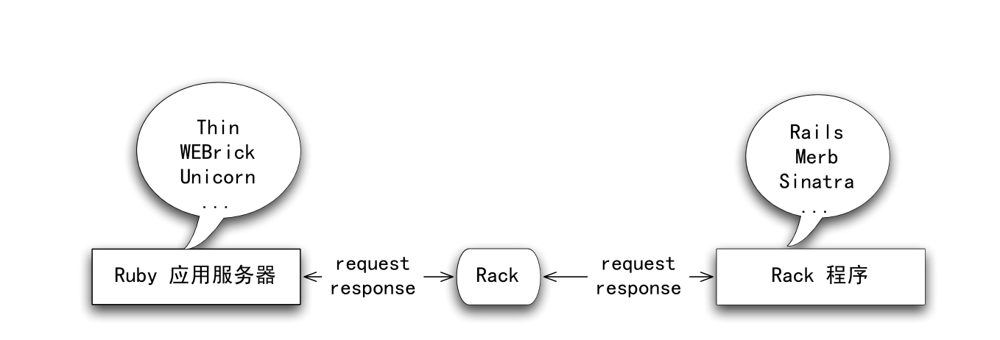

## 1.简介
### 1.1什么是Rack
Rack是Ruby应用服务器和Rack应用程序之间的一个接口。


用户的请求抵达应用服务器时，应用服务器会调用(call)Rack,Rack对请求进行包装，然后调用你的Rack程序。Rack程序可以方便的利用Rack所提供的各种API，分析请求，进行护理，并利用Rack提供的响应设施进行输出，Rack会把用户的响应作为输出返回给Ruby应用服务器。

严格来说，这样讲既不准确也不完整，但是很多概念会随着本书的深入得到澄清。

我们在本书中将不加区别的使用Web服务器和应用服务器这两个概念。这是因为通常来说Ruby编写的Web服务器总是位于一盒反向代理（nginx，apache等）后端，用来服务动态内容请求。

### 1.2 为什么Rack
#### 1.2.1 获得广泛支持的标准接口
首先Rack提供了一种标准的接了，便于应用程序和应用服务器之间的交互。一个Rack应用程序可以被任何和Rack兼容的应用服务器调用。

目前几乎所有的主流Ruby应用服务器都支持Rack接口。Rack通过一种叫做句柄(handler)的机制实现对应用服务器的支持。

#### 1.2.2 中间件
Rack利用中间件实现了最大程度的模块化。这当然可提高Web应用程序部件的可重用性，从而提高开发的效率。

Rack中间件对Ruby Web框架也有这深远的影响，包括：
- 不同的Web框架之间可以重用中间件，这意味着你可以编写的中间件可以在几乎所有的主流框架中使用
- 可以通过该不同的中间件组合组装出同一个Web框架的不同变种，以适合不同的应用场合
- 可以组合多个不同的Web应用矿建为通一个更大的系统服务

### 1.3 尝试
#### 1.3.1 安装
```shell
gem install rack
```

#### 1.3.2 Handler
启动irb，要使用Rack必须先引入rack包。
```ruby
require 'rubygems'
require 'rack'
```
查询Rack内嵌的所有Handler：
```ruby
Rack::Handler.constants #=> [:LSWS, :SCGI, :Thin, :FastCGI, :CGI, :WEBrick]
```

所有的Rack Handler都有一个run方法，你可以用
Rack::Handler::Thin.run ...
Rack::Handler::FastCGI.run ...
Rack::Handler::WEBrick.run ...
来运行你的Rack程序

### 1.3.3一个可被call的对象
那么一个Rack程序需要符合什么条件呢？
一个Rack应用程序是一个Ruby对象，只要这个对象能响应call。ruby中能够响应一个call的对象很多，包括：
- 一个lambda或者proc对象
- 一个method对象
- 任何一个对象，他的类包含一个call方法

我们先用最贱的空lambda{}作为run的第一个参数
```ruby
irb> Rack::Handler::WEBrick.run lambda{}, :Port=> 3000
[2022-11-23 17:10:16] INFO  WEBrick 1.7.0
[2022-11-23 17:10:16] INFO  ruby 3.0.0 (2020-12-25) [x86_64-darwin18]
[2022-11-23 17:10:16] INFO  WEBrick::HTTPServer#start: pid=12363 port=3000
```

第二个参数是一个hash，其中:Port指定WEBrick监听的端口。WEBrick给出的日志信息标识它已经正常启动。
打开浏览器，输入http://localhost:3000/

Internal Server Error
wrong number of arguments (given 1, expected 0)
WEBrick/1.7.0 (Ruby/3.0.0/2020-12-25) at localhost:3000

#### 1.3.4 返回一个数组
这个可被call的对象需要接受一个参数，及环境(environment)对象；需要返回一个数组，这个数组有三个成员：
1. 一个状态(status)，即http协议定义的状态码
2. 一个头(headers)，他可能是一个hash，其中包含所有的http头
3. 一个体(body)，它可能是一个字符串数组。

根据此要求，我们编写一个最简单的合法的Rack应用程序
```ruby
rack_app = lambda {|env| [200, {}, ['hello world!']]}
Rack::Handler::WEBrick.run rack_app, :Port => 3000
```

### 1.3.5 其他合法的应用程序
除了lambda外，我们的应用程序还可以是method对象：
```ruby
def any_method(env)
  [200, {}, ['hello from method']]
end
method(:any_method).call({})
```
method(:any_method)返回一个method对象，它可以被call，所以它也是一个Rack应用程序：
```ruby
rack_app = method(:any_method)
Rack::Handler::WEBrick.run rack_app, :Port => 3000
```

当然一个合法的Rack应用程序也可以是任何对象，只要它的类定义了call方法
```ruby
class AnyClass
  def call(env)
    [200, {}, ['hello from AnyClass']]
  end
end

rack_app = AnyClass.new
Rack::Handler::WEBrick.run rack_app, :Port => 3000
```


## 2.Rack初探
